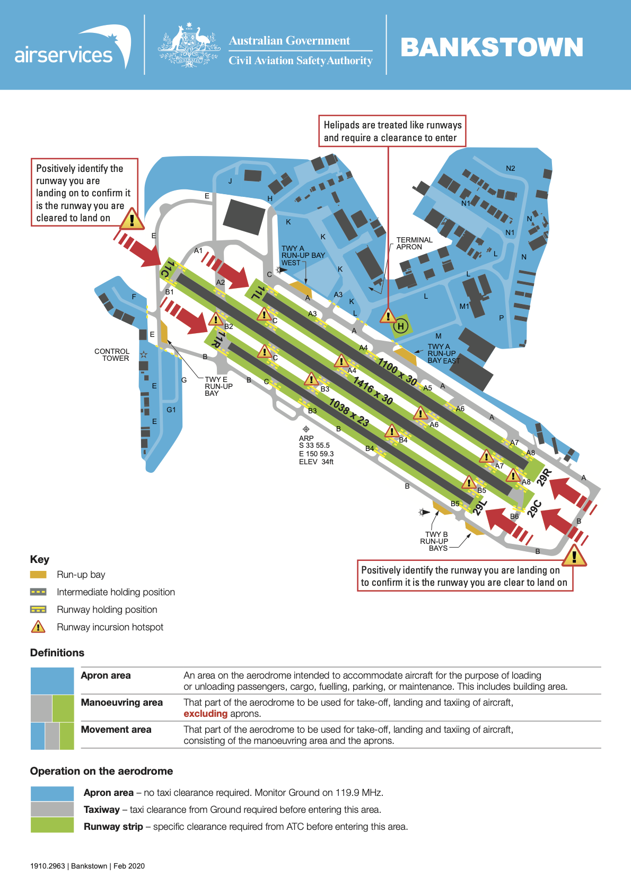

## RPL Operation Training Notes

### Table of Contents

[TOC]

### 1. Effects of Control

#### Primary Controls

|                      | Aileron        | Elevator       | Rudder       |
|----------------------|----------------|----------------|--------------|
| **Primary Effect**   | Roll           | Pitch          | Yaw          |
| **Secondary Effect** | Yaw            | Speed          | Roll         |
| **Controlled By**    | Control Column | Control Column | Rudder Pedal |
| **Axis**             | Longitudinal   | Lateral        | Normal       |

#### Ancillary Controls

- Trim
- Flaps
- Throttle
- Mixture
- Carburetor Heat

### 2. Straight and Level

Power setting for PA-28-161 Warrior III.

#### Normal Cruise

| Warrior III  | Normal Cruise     |
|--------------|-------------------|
| **Power**    | 2,400 - 2,450 RPM |
| **Attitude** | 1/3 Ground        |
| **Speed**    | 105 kts           |
| **Trim and Balance** |           |

#### Fast Cruise

| Warrior III  | Fast Cruise                     |
|--------------|---------------------------------|
| **Power**    | 2,500 RPM                       |
| **Attitude** | Slightly lower than 1/3 ground  |
| **Speed**    | 110 kts                         |
| **Trim and Balance** |                         |

#### Slow Cruise

| Warrior III  | Slow Cruise      |
|--------------|------------------|
| **Power**    | 1,900 RPM        |
| **Attitude** | Nose on horizon  |
| **Speed**    | 75 kts           |
| **Trim and Balance** |          |

#### Safe Slow Cruise

| Warrior III  | Safe Slow Cruise               |
|--------------|--------------------------------|
| **Power**    | 2,100 RPM                      |
| **Attitude** | 1/2 Ground, 2 stages of flaps  |
| **Speed**    | 70 kts                         |
| **Trim and Balance** |                        |

### 3. Climbing

Power setting for PA-28-161 Warrior III.

#### Best Angle Climb

| Warrior III  | Best Angle Climb ($\mathrm{V_x}$) |
|--------------|-----------------------------------|
| **Power**    | Full Power                        |
| **Attitude** | All Sky                           |
| **Speed**    | 63 kts                            |
| **Trim and Balance** |                           |

#### Best Rate Climb

| Warrior III  | Best Rate Climb ($\mathrm{V_y}$) |
|--------------|----------------------------------|
| **Power**    | Full Power                       |
| **Attitude** | Nose on horizon                  |
| **Speed**    | 79 kts                           |
| **Trim and Balance** |                          |

#### Cruise Climb

| Warrior III  | Cruise Climb       |
|--------------|--------------------|
| **Power**    | Full Power         |
| **Attitude** | Just below horizon |
| **Speed**    | 87 kts             |
| **Trim and Balance** |            |

### 4. Descending

Power setting for PA-28-161 Warrior III.

#### Glide Descend

| Warrior III  | Glide Descend |
|--------------|---------------|
| **Power**    | Idle          |
| **Attitude** | 1/3 Ground    |
| **Speed**    | 73 kts        |
| **Trim and Balance** |       |

#### Cruise Descend

| Warrior III  | Cruise Descend  |
|--------------|-----------------|
| **Power**    | 2,100 RPM       |
| **Attitude** | 1/3 Ground      |
| **Speed**    | 95 kts          |
| **Trim and Balance** |         |

#### Approach Descend

| Warrior III  | Approach Descend               |
|--------------|--------------------------------|
| **Power**    | 1,500 RPM                      |
| **Attitude** | 1/2 Ground, 2 stages of flaps  |
| **Speed**    | 75 kts                         |
| **Trim and Balance** |                        |

### 5. Turning

**Effect on Stall Speed:** \[\text{New Stall Speed} = \text{Old Stall Speed} \times \sqrt{G}\]

### 6. Stalling

#### HASELL Checks

- **Height:** Sufficient to recover, by at least **3,000 ft AGL**.
- **Airframe:** Flaps, landing gear, brakes and trim.
- **Security:** Loose items, harnesses.
- **Engine:** Fuel on **FULLEST** tank, fuel pump **ON**, engine instrument in **GREEN**, mixture **RICH** and carby heat **ON**.
- **Location:** Airspace, populated area, landing site.
- **Lookout:** 360° turn.

#### Clean Stall Entry

Clean stall are entered from straight and level flight.

* HASELL checks;
* Reference point selected;
* Fuel pump on;
* Carby heat on;
* Close throttle to idle;
* Slowly raise the nose and maintain altitude, allowing the airspeed to decrease;
* Maintain reference point with rudder.

#### Clean Stall Recovery

**Simultaneously:**
* Aileron neutral;
* Relax the back pressure, set attitude for S & L;
* Rudder to prevent further yaw or wing drop;
* Apply full power.

**When the wing are un-stalled:**
* Level the wings with aileron;
* Raise the nose to the climb attitude *(Warning: be cautious of secondary stall)*
* Resume normal climb and complete the After Take Off checks.

#### Approach Stall Entry

This stall simulates the aeroplane coming in to land in the approach configuration.

* HASELL checks;
* Reference point selected;
* Fuel pump on;
* Carby heat on;
* Reduce power to 1,500 RPM;
* Select 2 stage of flap when airspeed in white arc and trim;
* Slowly raise the nose and maintain altitude, allowing the airspeed to decrease;
* Maintain reference point with rudder.

#### Approach Stall Recovery

**Simultaneously:**
* Aileron neutral;
* Relax the back pressure, set attitude for S & L;
Rudder to prevent further yaw or wing drop;
Apply full power.

**When the wing are un-stalled:**
* Level the wings with aileron;
* Raise the nose to the climb attitude *(Warning: be cautious of secondary stall)*
* After achieving at least 60 KIAS and a positive rate of climb, retract flaps and on stage at a time
* Resume normal climb and complete the After Take Off checks.

#### Incipient Spin Recovery

**Simultaneously:**
* Ailerons neutral;
* Reduce power to idle;
* Apply sufficient forward pressure to unstall the wings and apply full and opposite rudder;
* Once rotation stops, release rudder pressure.

**When the wing are un-stalled:**
* Level the wings with aileron;
* Add full power, carby heat off;
* Raise the nose to the climb attitude;
* Resume normal climb and complete the After Take Off checks.

### 7. Circuits

- **Take-off:**
- **Upwind:**
- **Crosswind:**
- **Downwind:**
- **Base:**
- **Final:**
- **Landing:**
- **Touch & Go:**
- **Radio:**

#### Radio for Circuits

| Bankstown Airport Service | Frequency (MHz) |
|---------------------------|-----------------|
| Ground                    | `119.90`        |
| ATIS                      | `120.90`        |
| Tower - Circuits          | `123.60`        |
| Tower - Departure         | `132.80`        |

*Bankstown Ground, Cherokee LXP, on Taxiway H, Received Information `Y`, Request Start for Circuits.*

> - *Start Approved, LXP.*

*Bankstown Ground, LXP, on Taxiway `C/L`, Request Taxi for Circuits.*

> - **Runway 11R, Taxiway C:** *Taxi via A1, J and E to E Run Up Bay, LXP.*
> - **Runway 29L, Taxiway L:** *Taxi via A and B to B Run Up Bay, LXP.*

*Bankstown Ground, LXP, Ready in the Bay.*

> - *Taxi to Holding Point `B2` via `B`, Runway `11R`, LXP.*
> - *Taxi to Holding Point `B5` via `B`, Runway `29L`, LXP.*

*Bankstown Tower, LXP, on Holding Point `B2/B5`, Runway `11R/29L`, Ready for Circuits.*

> - *Holding Position, LXP.*
> - *Line Up and Wait, Runway `11R/29L`, LXP.*
> - *Cleared for Take-off, Runway `11R/29L`, LXP.*

*LXP, Downwind, Touch and Go.*

> - *Number 1, LXP.*
> - *Traffic Sighted, LXP.*
> - *Looking for Traffic, LXP.*
> - *Clear to Touch and Go, Runway `11R/29L`, LXP.*

*LXP, Downwind, Full Stop.*

> - *Clear to Land, Runway `11R/29L`, LXP.*
