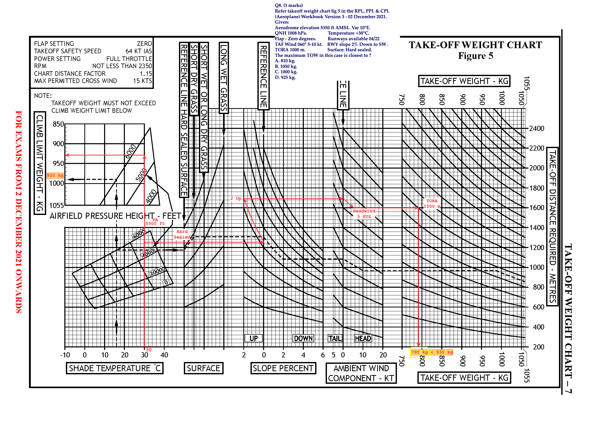
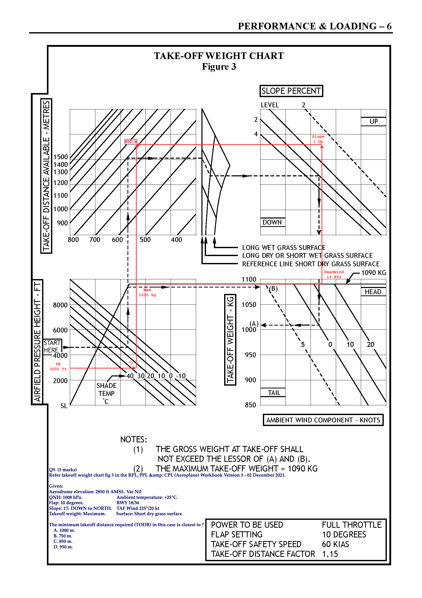
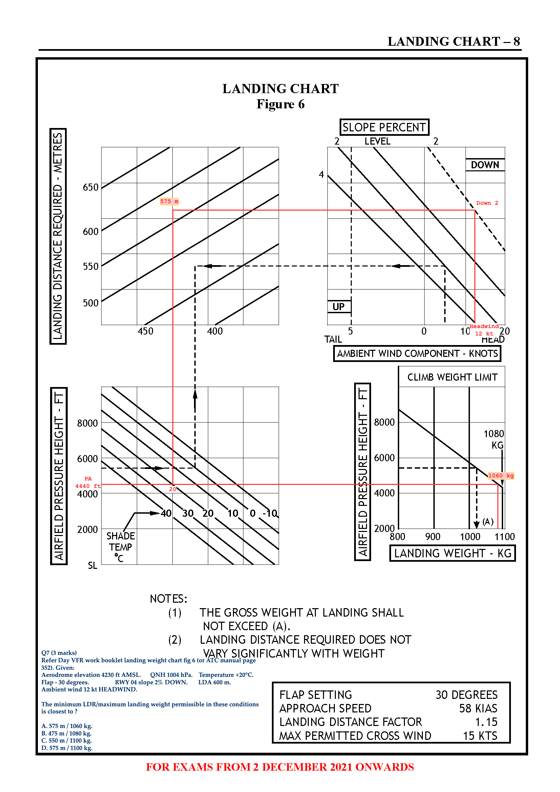
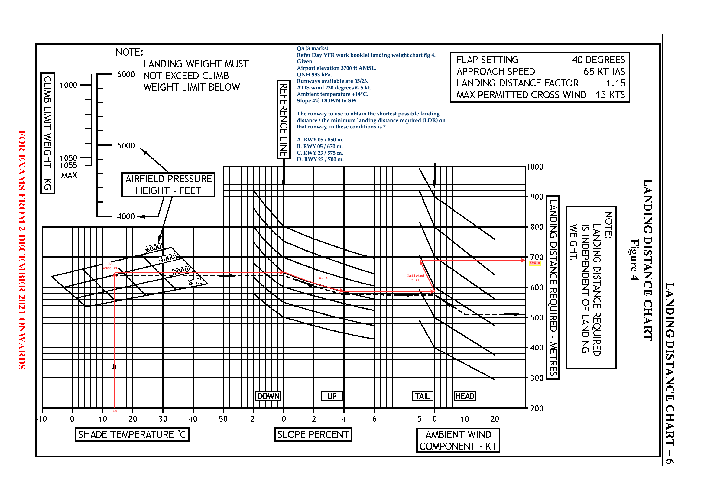

## RPL Theorem Study Questions

[TOC]

### AV16 Basic Aeronautical Knowledge Quiz's

#### Module 1: What is an Aircraft

##### M1.Q6 (1 mark)

**The power to taxi on the ground is provided by ?**

- [ ] A. The main wheels being gear driven from the engine, through a gearbox.
- [X] B. The propeller.
- [ ] C. Both the propeller and the engine driven main gear wheels.

##### M1.Q8 (1 mark)

**Brakes are fitted to the main wheels, and ?**

- [ ] A. Are operated by applying pressure to the rudder pedals.
- [X] B. Can be operated on the left or right side independently.
- [ ] C. Are operated by applying pressure to the rudder pedals, but can not be operated independently of each other.

##### M1.Q9 (1 mark)

**The ground stability of an aircraft is greatest in ?**

- [X] A. Tricycle type wheel arrangements.
- [ ] B. Tail-wheel type wheel arrangements.
- [ ] C. Tail-wheel and tricycle type wheel arrangements equally.

##### M1.Q15 (1 mark)

**"Induced Drag" is caused by ?**

- [X] A. The creation of lift.
- [ ] B. The resistance to air flow by the aircraft structure.
- [ ] C. The sum of resistance to airflow by the aircraft structure, and the creation of lift.

##### M1.Q16 (1 mark)

**The difference in pressure above the wing to that below it is effected by ?**

- [ ] A. The area of the wing only.
- [ ] B. The speed of the wing through the air only.
- [X] C. The speed of the wing through the air, and the angle of attack.

##### M1.Q28 (1 mark)

**During a turn to the right, the skid ball is to the right of centre. In this case to "balance the turn" you should ?**

- [ ] A. Not use the rudder pedals.
- [X] B. Step on the right rudder pedal.
- [ ] C. Step on the left rudder pedal.

##### M1.Q30 (1 mark)

**The "Directional Gyroscope Compass" (DG) is aligned with ?**

- [ ] A. True north.
- [X] B. Magnetic north.
- [ ] C. Both true and magnetic north simultaneously.

##### M1.Q33 (1 mark)

**On an altimeter, the big pointer is on 9 and the small pointer is indicating slight less than 5. The altitude of the aircraft is ?**

- [ ] A. Unable to be found on this instrument.
- [X] B. 4900 ft.
- [ ] C. 9400 ft.

#### Module 11b: Performance 2 - "P" Takeoff Chart

##### M11B.Q8 (3 marks)

**Refer takeoff weight chart fig 5 in the RPL, PPL & CPL (Aeroplane) Workbook Version 3 - 02 December 2021. Given:**
- *Aerodrome elevation 5350 ft AMSL. Var 10°E.*
- *QNH 1008 hPa. Temperature +30°C.*
- *Flap - Zero degrees.*
- *Runways available 04/22. TAF Wind 060° 5-10 kt.*
- *RWY slope 2% Down to SW. Surface: Hard sealed.*
- *TORA 1000 m.*

**The maximum TOW in this case is closest to ?**

- [X] A. 810 kg.
- [ ] B. 1050 kg.
- [ ] C. 1000 kg.
- [ ] D. 925 kg.

##### M11B.Q9 (3 marks)

**Refer takeoff weight chart fig 3 in the RPL, PPL & CPL (Aeroplane) Workbook Version 3 - 02 December 2021. Given:**
- *Aerodrome elevation: 2850 ft AMSL. Var Nil.*
- *QNH: 1008 hPa. Ambient temperature: +25°C.*
- *Flap: 10 degrees.*
- *RWY 18/36. TAF Wind 225°/20 kt*
- *Slope: 1% DOWN to NORTH. Surface: Short dry grass surface*
- *Takeoff weight: Maximum.*

**The minimum takeoff distance required (TODR) in this case is closest to ?**

- [ ] A. 1000 m.
- [ ] B. 750 m.
- [ ] C. 850 m.
- [X] D. 950 m.

#### Module 11c: Performance 2 - "P" Landing Chart

##### M11C.Q7 (3 marks)

**Refer Day VFR work booklet landing weight chart fig 6 (or ATC manual page 352). Given:**
- *Aerodrome elevation 4230 ft AMSL.*
- *QNH 1004 hPa.*
- *Temperature +20°C.*
- *Flap - 30 degrees.*
- *RWY 04 slope 2% DOWN.*
- *Ambient wind 12 kt HEADWIND.*
- *LDA 600 m.*

**The minimum LDR/maximum landing weight permissible in these conditions is closest to ?**

- [X] A. 575 m / 1060 kg.
- [ ] B. 475 m / 1080 kg.
- [ ] C. 550 m / 1100 kg.
- [ ] D. 575 m / 1100 kg.

##### M11C.Q8 (3 marks)

**Refer Day VFR work booklet landing weight chart fig 4. Given:**
- *Airport elevation 3700 ft AMSL.*
- *QNH 993 hPa.*
- *Runways available are 05/23.*
- *ATIS wind 230 degrees @ 5 kt.*
- *Ambient temperature +14°C.*
- *Slope 4% DOWN to SW.*

**The runway to use to obtain the shortest possible landing distance / the minimum landing distance required (LDR) on that runway, in these conditions is ?**

- [ ] A. RWY 05 / 850 m.
- [X] B. RWY 05 / 670 m.
- [ ] C. RWY 23 / 575 m.
- [ ] D. RWY 23 / 700 m.

